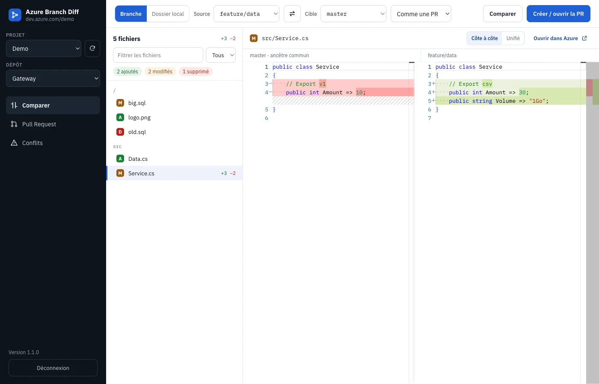
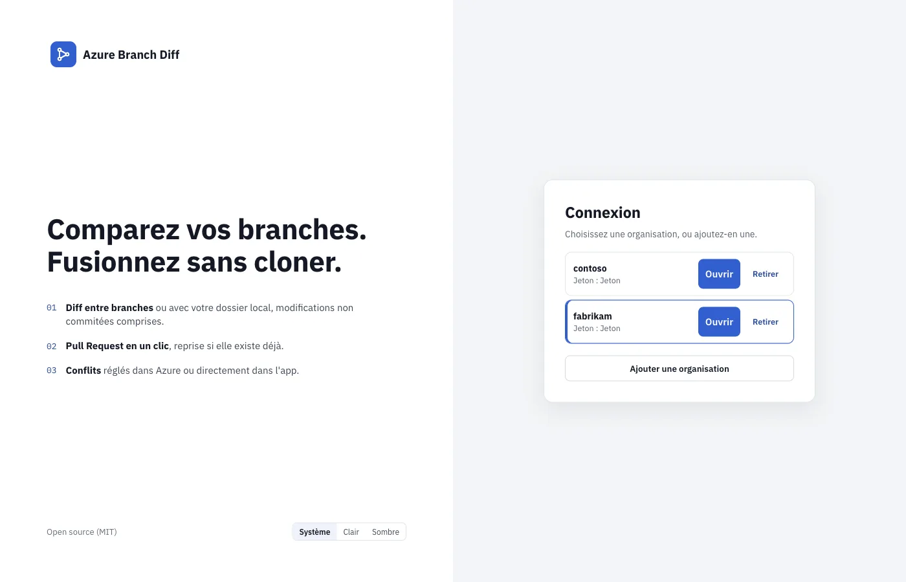
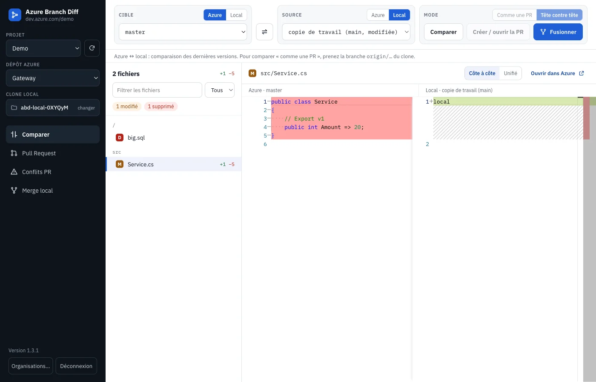
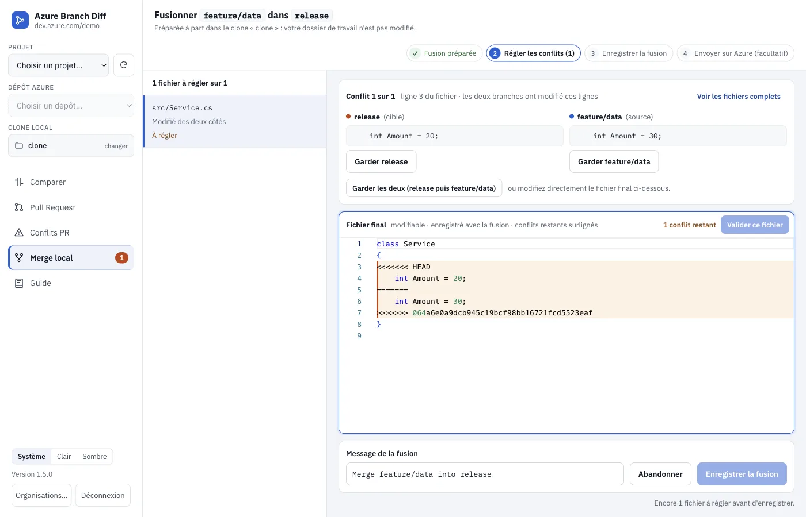
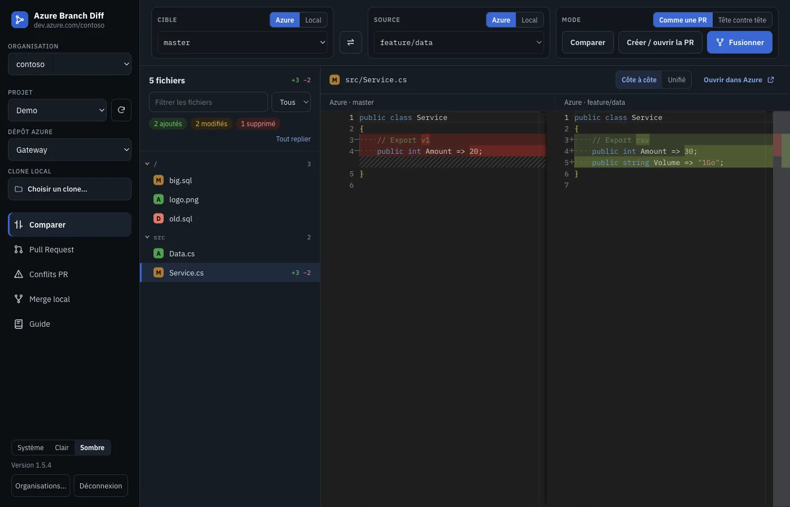

# Azure Branch Diff

[](https://github.com/khalilbenaz/azure-branch-diff/actions/workflows/ci.yml)
[](https://github.com/khalilbenaz/azure-branch-diff/releases/latest)

Application de bureau (macOS et Windows) pour **comparer, fusionner et publier** des branches Azure DevOps — sans cloner, ou avec votre clone local.

- **Comparer** deux côtés, chacun **branche Azure** ou **référence locale** (branche, `origin/*`, copie de travail, ou simple dossier téléchargé) : Azure ↔ Azure, Azure ↔ local, local ↔ local. Diff côte à côte avec l'éditeur de VS Code.
- **Pull Request** : créer ou reprendre la PR, régler les conflits dans Azure ou dans l'app, compléter la PR.
- **Merge local dans toutes les directions** : dans un worktree temporaire (votre copie de travail n'est jamais dans un état de merge), conflits réglés dans l'app, commit, push.
- **Plusieurs organisations** : un jeton par organisation ou un jeton multi-organisations, bascule depuis la barre latérale.
- **Thème clair, sombre ou système**, sur toute l'interface ; **guide d'utilisation** intégré (onglet *Guide*).

**Site et téléchargements : https://khalilbenaz.github.io/azure-branch-diff/** · **[Guide d'utilisation](https://khalilbenaz.github.io/azure-branch-diff/guide.html)**



## Installation

| Système | Fichier |
|---|---|
| macOS Apple Silicon | [`Azure-Branch-Diff-mac-arm64.dmg`](https://github.com/khalilbenaz/azure-branch-diff/releases/latest/download/Azure-Branch-Diff-mac-arm64.dmg) |
| macOS Intel | [`Azure-Branch-Diff-mac-x64.dmg`](https://github.com/khalilbenaz/azure-branch-diff/releases/latest/download/Azure-Branch-Diff-mac-x64.dmg) |
| Windows 64 bits | [`Azure-Branch-Diff-Setup.exe`](https://github.com/khalilbenaz/azure-branch-diff/releases/latest/download/Azure-Branch-Diff-Setup.exe) |

Les installeurs ne sont **pas signés par un certificat éditeur** :

- **macOS** : glisser l'app dans Applications, puis au premier lancement **clic droit → Ouvrir**. Si macOS indique que l'app est endommagée : `xattr -dr com.apple.quarantine "/Applications/Azure Branch Diff.app"`.
- **Windows** : SmartScreen → **Informations complémentaires → Exécuter quand même**.

**git** est nécessaire pour les côtés locaux (clone) et le merge ; l'app le cherche aussi dans les emplacements Homebrew et Git pour Windows.

### Mises à jour

Vérification au démarrage puis toutes les 4 heures (Releases GitHub) :

- **Windows** : téléchargement en arrière-plan, installation au redémarrage ;
- **macOS** : téléchargement en arrière-plan, vérification (empreinte SHA-512 publiée dans la release, identifiant et version de l'app, signature), puis remplacement de l'app au redémarrage. Si l'app n'est pas dans un dossier modifiable (ex. lancée depuis le `.dmg`), elle ouvre la page de téléchargement.

## Connexion et organisations



Azure DevOps → avatar → **Personal access tokens** → **New Token**, avec les droits **Code — Read & Write** et **Work Items — Read**.

- **Un jeton par organisation**, ou **un jeton pour toutes les organisations accessibles** : « **Découvrir mes organisations** » les liste, vous cochez celles à ajouter.
- Ajouter une organisation : nouveau PAT (nommé) ou **jeton déjà enregistré**.
- Une fois connecté, le sélecteur **Organisation** de la barre latérale bascule de l'une à l'autre (le clone local est gardé). **Déconnexion** ramène à la liste sans rien oublier ; **Retirer** oublie une organisation (et son jeton s'il ne sert plus).

Les jetons sont chiffrés par le trousseau du système (Keychain, DPAPI), jamais écrits en clair ni transmis à l'interface.

## Utilisation

**Barre latérale** : le **dépôt Azure** et/ou le **clone local** (choisi à sa racine ; un dossier sans git, comme une archive téléchargée, est accepté pour comparer).

**Barre d'outils** : trois cartes, dans le même ordre que le diff — ce qui est à gauche s'affiche à gauche :

| Cible (gauche) | ⇄ | Source (droite) | Mode et actions |
|---|---|---|---|
| `Azure` ou `Local`, puis la branche | inverse | `Azure` ou `Local`, puis la branche | **Comme une PR** (seulement ce que la source apporte ; fichiers déjà portés masqués) ou **Tête contre tête** ; **Comparer**, **Créer / ouvrir la PR**, **Fusionner** |

Dans le diff : à gauche la cible, à droite la source, toujours dans leur **état actuel** ; **vert** = ce que la source apporte, **rouge** = ce qu'elle retire.

Liste des fichiers : les fichiers qui ne diffèrent que par des espaces (indentation, lignes vides, CRLF / LF) sont masqués, comme ceux déjà identiques sur la cible ; filtre par nom ou extension ; chaque dossier se replie d'un clic (**Tout replier / Tout déplier**).

| Cible ← Source | Comparer | PR Azure | Fusionner (merge local) |
|---|---|---|---|
| Azure ← Azure | ✓ | ✓ | worktree, puis push vers la cible |
| Azure ← Local | ✓ (dernières versions) | ✓ (la branche locale est d'abord poussée) | worktree sur `origin/cible`, puis push |
| Local ← Azure | ✓ (dernières versions) | — | merge de `origin/source` dans la branche locale, push optionnel |
| Local ← Local | ✓ | — | merge, commit, push optionnel |



### Conflits

- **PR Azure** : onglet **Conflits PR** — « Régler dans Azure » ou « Régler dans l'app » (cible à gauche, source à droite, résultat modifiable, *Garder cible / source / les deux*).
- **Fusion (merge local)** : onglet **Merge local**, en 4 étapes (fusion préparée → conflits → enregistrer → envoyer sur Azure). Chaque conflit est présenté seul, version de la cible et de la source côte à côte : **Garder main / dev / les deux**, ou édition du fichier final ; fichiers binaires ou supprimés d'un côté : garder une version ou supprimer.



Si Azure refuse le push (politique de branche), l'app propose **« Créer une PR à la place »**. Avant chaque push, une **confirmation native** indique le remote et la branche. Un commit de merge non poussé reste conservé dans `refs/abd/merges/`.

### Thème et guide

En bas de la barre latérale (et sur l'écran de connexion) : **Système**, **Clair** ou **Sombre**. Le choix est retenu et s'applique à toute l'interface, éditeur compris. L'onglet **Guide** reprend le [guide d'utilisation](https://khalilbenaz.github.io/azure-branch-diff/guide.html).



## Sécurité

Résumé (détails dans [SECURITY.md](SECURITY.md)) : jetons chiffrés et jamais exposés à l'interface ; Electron verrouillé (isolation, sandbox, CSP, fuses) ; seuls les dossiers choisis dans la boîte de dialogue sont lisibles ; git lancé sans shell, hooks / fsmonitor / signatures neutralisés, et dépôts dont la configuration exécuterait des commandes refusés selon l'opération (lecture, merge, réseau) — Git LFS et gestionnaires d'identifiants usuels acceptés.

## Développement

```bash
npm install
npm run dev              # mode développement
AZ_FAKE=1 npm run dev    # démo : Azure simulé en mémoire (n'importe quel jeton)
npm test                 # tests unitaires, sécurité, performance (Vitest)
npm run typecheck
npm run e2e              # build + E2E : parcours, merge, organisations, sécurité Electron, accessibilité, performance
npm run dist:mac         # installeurs macOS (sur macOS)
npm run dist:win         # installeur Windows
```

### Publier une version

```bash
npm version minor                               # met à jour package.json et crée le tag vX.Y.Z
git push --follow-tags                          # la CI vérifie le tag, teste et construit les installeurs
gh release edit vX.Y.Z --draft=false            # après vérification du brouillon : publication (mises à jour)
```

La CI publie la release en **brouillon** (invisible pour les mises à jour automatiques) avec `SHA256SUMS.txt`.

**Signature macOS** : l'app est signée avec un certificat auto-signé du projet (secrets `MAC_CERT_P12`, `MAC_CERT_PASSWORD`, crochet `build/after-sign.cjs`). Son identité reste la même d'une version à l'autre : le trousseau macOS ne redemande pas le mot de passe après une mise à jour, et l'app n'installe qu'une mise à jour signée par ce même certificat. Sans ces secrets (build local, fork), la signature reste ad hoc.

### Architecture

- `src/main` : processus principal Electron, seul à détenir les jetons.
  - `azure/` : API Azure DevOps (navigation, diff, PR, conflits, découverte des organisations) et `fake.ts` (Azure en mémoire) ;
  - `local/` : clones et dossiers locaux (git sans shell, configuration neutralisée) ; `compare/` : les trois combinaisons de comparaison ;
  - `merge/` : merge local (worktree, conflits, commit, push, contrôles de sécurité, nettoyage) ;
  - `ipc.ts` : API exposée à l'interface (arguments validés) ; `auth.ts` : organisations et jetons chiffrés ; `updater.ts` : mises à jour.
- `src/preload` : pont `window.api` / `window.updates` (isolation de contexte, sandbox).
- `src/renderer` : interface React + Monaco.
- `site/` : page GitHub Pages.

## Licence

MIT. Projet indépendant, non affilié à Microsoft.
